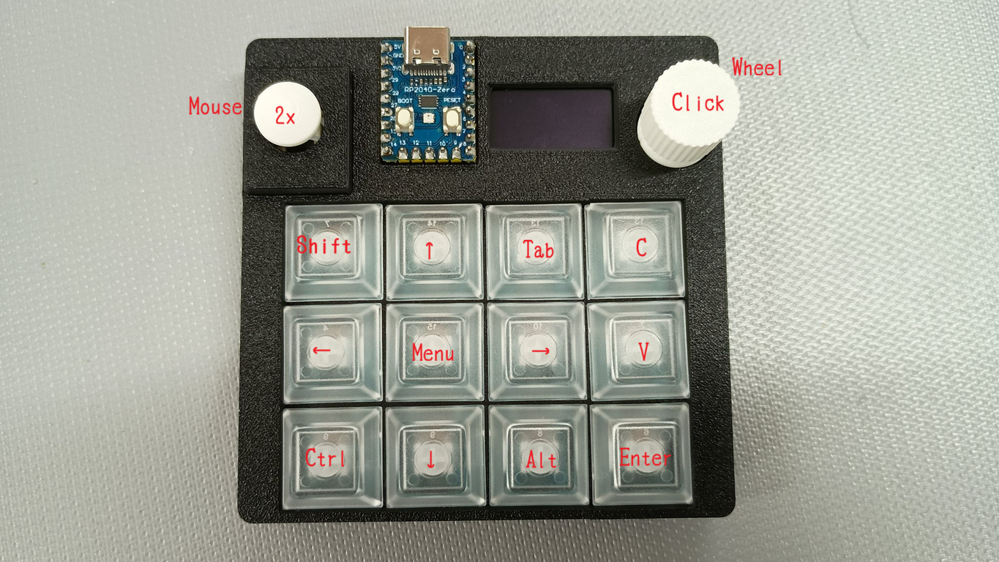

# zero-kb02-joykeyboard

Useful keyboard & mouse using zero-kb02.

## Usage



## Requirements

* tinygo

## Installation

```console
tinygo flash --target waveshare-rp2040-zero --size short .
```

## License

MIT

## Author

Yasuhiro Matsumoto (a.k.a. mattn)
